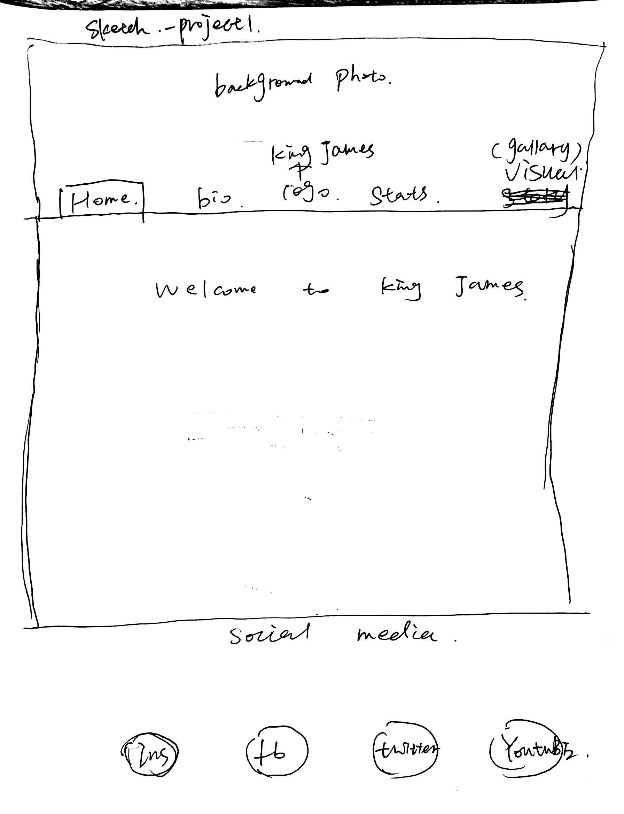
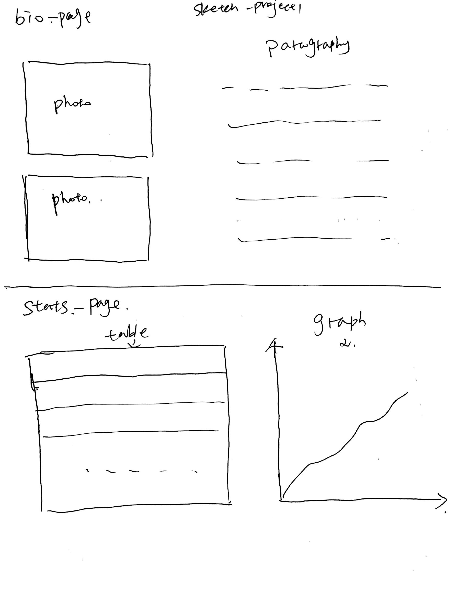
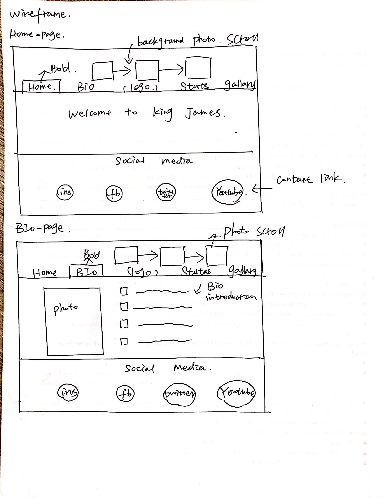
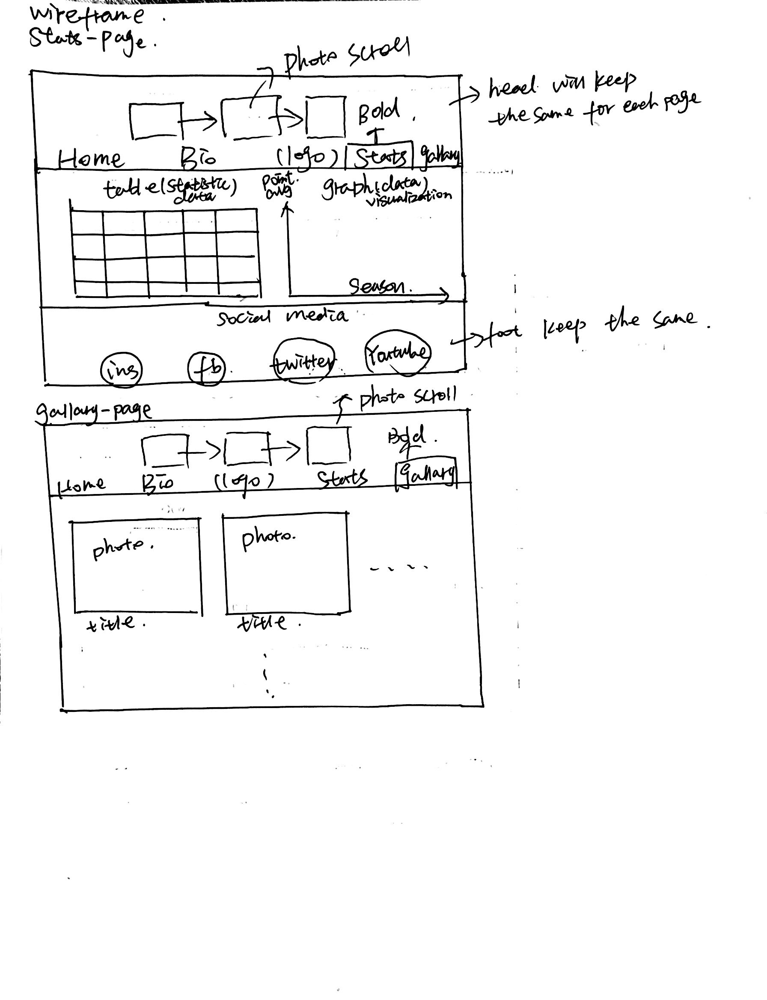

# Project 1, Milestone 1 - Design & Plan

## 1. Persona

[I've selected Abby as my persona.](personas.pdf)

I've selected my persona because her personality represents a large number of users, a huge number of users don't have much sapre time to learn new technologies and prefer to use methods that they familiar with.  If I design a website that works comfortably for this persona, this website will be a good design for both users with low computer self-efficacy and users with high computer self-efficacy.  an easy-to-use website always performs well for all people.

## 2. Sketches

My sketches illustrate that there will be a index in the head of each page and it will be very simple for a user to browse web page and get the information they want since the layout of the web page is succinct and clear.

## 3. Wireframes

I change a little bit for the final submission. Since in this project, extra library is not allowed, I plan to use d3.js to create a mountain graph for Lebron James stats at the very beginning but I didn't realize it in the end.  However, in stats page, I display his career stats in a table using php defined function.  For the header, I plan to make header picture slided.  However, I change my mind because I think it is not succinct and I realize sliding Lebron James shoes design pictures in the gallery page.

## 4. Coding Plan & Pseudocode

For the table building in the stats-page, I will use a function to transmit data in <th>, <tr> and <td> tag using for loop in order to simplify my HTML code.  Firstly, I will transmit Lebron James's stats stored in csv file to an array named seasons in php and then I use a user function defined to write these data in table tag.   

At the top of stats.php:

function print_data_for_season($season) for each(data in season) prints out data enclosed in a <td> tag

in the HTML body:

for each(season in seasons) call print_data_for_season($season)
